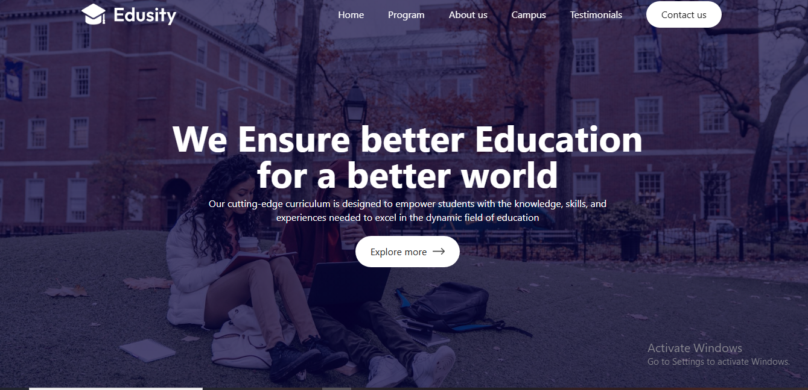

# 🎓 College Website

A **College Website** built using **React.js, Tailwind CSS, React-Scroll, and Web3Forms**.  
This project provides a modern, responsive design to showcase college information, courses, facilities, and includes a **contact form** powered by Web3Forms.

---

## 🔗 Live Demo

👉 [Click Here to Visit College Website](https://your-live-preview-link.com)

---

## 🛠️ Tech Stack

[](https://reactjs.org/)  
[](https://tailwindcss.com/)  
[](https://www.npmjs.com/package/react-scroll)  
[](https://web3forms.com/)  
[](https://vercel.com/)

---

## 📸 Preview



---

## 📌 Features

- ⚡ Fast and responsive design
- 🎨 Built with Tailwind CSS for modern styling
- 📜 Smooth navigation with React-Scroll
- 💬 Contact form powered by Web3Forms (no backend required)
- 📱 Fully responsive (mobile, tablet, desktop)
- 🌙 Clean, minimal, and SEO-friendly structure

---

## ⚙️ Installation & Setup

Clone the repository:

```bash
git clone https://github.com/your-username/college-website.git
cd college-website
```
